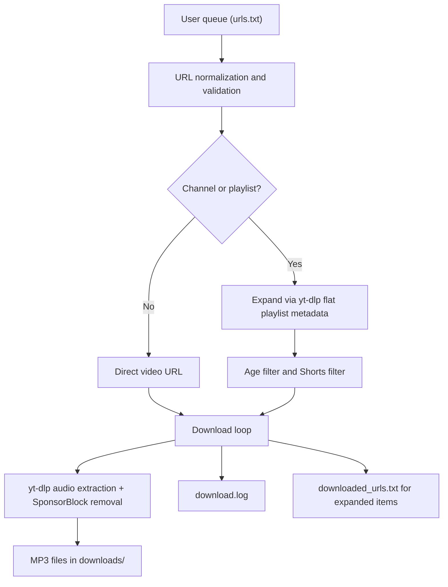

# Project Overview

## Summary and Purpose

Podcast Downloader turns YouTube videos into local MP3 files with SponsorBlock segment removal. It is designed for a personal queue-based workflow rather than a large multi-user service: the user keeps a list of YouTube URLs, the downloader expands channels and playlists into concrete videos, filters out Shorts, downloads audio with `yt-dlp`, and stores the resulting MP3 files locally.

The project also includes a minimal web UI so new URLs can be added remotely without editing the queue file by hand. That UI now also shows the exact monitored contents of `urls.txt` and lets the operator remove entries directly from the browser. The CLI and the web UI now expose the same one-shot age-gate bypass for time-sensitive direct video URLs.

## Inputs and Outputs

### Inputs

- A text queue of YouTube URLs.
- Supported URL classes:
  - Direct video URLs
  - Short `youtu.be` URLs
  - Channel URLs
  - Playlist URLs
- A configuration file controlling polling depth, output paths, and network-related behavior.
- A UI password file for browser-based access.

### Outputs

- MP3 files in the downloads directory.
- A runtime log showing successes, failures, and URL expansion activity.
- A historical archive of already-processed expanded URLs.
- A small persistent state file for login lockouts.

## Architecture and Data Flow

The system is intentionally linear:

### End-to-end flow

1. The queue file is read and non-YouTube or commented lines are ignored.
2. Each URL is normalized so equivalent video links collapse to one canonical form.
3. Channel and playlist URLs are expanded into individual video URLs using `yt-dlp --flat-playlist`; both source types use `channel_count` as the latest-entry target.
4. Direct video URLs can also be held back by the configured age gate unless the operator explicitly requests a one-shot bypass.
5. Channel expansions apply two filters:
   - Shorts are skipped.
   - Videos newer than the configured age threshold are skipped when their age can be determined.
6. Each concrete video URL is downloaded as audio and converted to MP3.
7. SponsorBlock removal is requested during the download pipeline.
8. Success is inferred from actual MP3 file creation or modification, not just process exit code.
9. Successful direct video URLs are removed from the queue file.
10. Successful expanded URLs are written to the archive file so future channel scans stay idempotent.

Queue-file reads and writes are now guarded by an interprocess file lock. This prevents the web UI and the downloader from losing queued URLs when they touch `urls.txt` at the same time. The same locking approach now protects `downloaded_urls.txt`, because that archive is both appended by the downloader and read synchronously by the web UI for duplicate detection.

On the UI side, the queue page is no longer just a write-only ingest form. It is now a lightweight queue-management surface: it renders the current monitored URLs from `urls.txt`, pairs each one with a CSRF-protected remove action, and reuses the same normalization rules as the CLI so short YouTube links and canonical watch URLs are treated as the same item.

### Container deployment model

In Docker deployments, the project uses one container process with two responsibilities:

- The web server stays in the main process so a web crash terminates the container and allows Docker to restart it.
- The download scheduler runs in a background thread and forces the container to exit if it crashes unexpectedly.
- The scheduler interval is configured with `DOWNLOAD_INTERVAL_HOURS`, and startup now fails immediately if that value is not a positive integer.

The mounted data directory is durable state. On first boot, the container copies the repo's default configuration into that directory if no configuration file exists yet, then creates any missing queue or state files.
The same bootstrap step now stores a PBKDF2 hash in `.ui_password`. If the repo already contains `.ui_password` when the image is built, first boot copies that file into the mounted data directory automatically. Otherwise first boot uses the default password `.ui_password`, and later restarts rewrite any legacy clear-text or `CHANGE_ME` file into a hash automatically.

## Core Operational Model

This project does not implement financial mathematics or model estimation. Its core logic is operational:

- URL normalization keeps duplicate links from entering the queue in multiple forms.
- Channel expansion trades API simplicity for external dependency on `yt-dlp`.
- Age filtering reduces the chance of downloading videos before SponsorBlock segments are fully available, and the bypass file gives the operator a narrow manual override for exceptional cases.
- File-change detection is used as the success criterion because a download can legitimately overwrite an existing MP3 without increasing the file count.

## Assumptions and Limitations

- The project depends on `yt-dlp` and `ffmpeg` being available in the runtime environment.
- Docker deployments use best-effort `yt-dlp` auto-updates so the downloader can stay current without making startup depend on package-index availability. The scheduled path upgrades only `yt-dlp` itself and waits 5 minutes before downloading.
- Sessions for the web UI are stored only in process memory, so restarting the API invalidates all active sessions.
- The web UI is suitable for light personal use, not for multi-user internet-facing deployment.
- The login surface is hardened with one-time expiring CSRF tokens and basic anti-caching / anti-framing response headers, and failed logins now return to the HTML form instead of exposing a raw JSON error page, but it is still intentionally simple rather than a full identity system.
- The queue page now uses a nonce-based Content Security Policy so the live log viewer can run without opening the page up to arbitrary inline JavaScript.
- When channel video age is unknown, the current policy is to allow the item rather than drop it.
- SponsorBlock correctness ultimately depends on upstream data availability for the target video.

## User Overrides

This workspace is maintained with an explicit preference for:

- `uv`-managed Python environments and dependency changes.
- Incremental, verified changes instead of speculative refactors.
- Project documentation staying in sync with code changes in the same turn.
