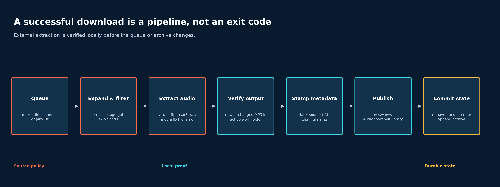
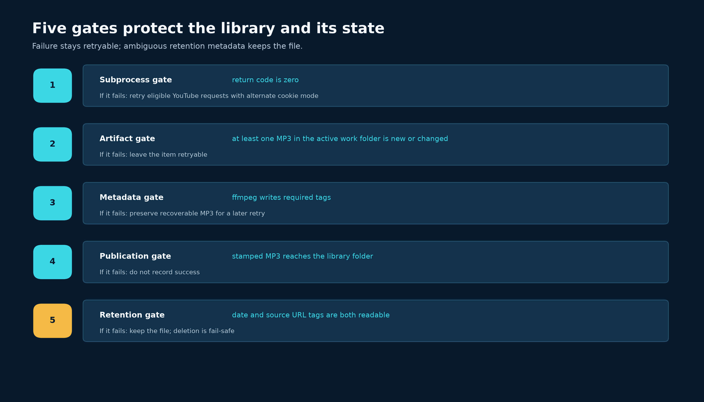

# Un téléchargeur de podcasts qui ne fait pas confiance au code de sortie 0

Je voulais un petit service pour surveiller une chaîne YouTube, retirer les segments sponsorisés et déposer les épisodes terminés dans Audiobookshelf. Cela ressemble à une commande entourée d'un scheduler. L'essentiel du projet s'est pourtant joué dans la gestion des échecs autour de cette commande.

`yt-dlp` se charge de l'extraction. SponsorBlock fournit des plages temporelles maintenues par la communauté pour les segments de sponsoring et d'autopromotion. `ffmpeg` recopie l'audio tout en mettant ses tags à jour. Ces outils prennent en charge le traitement multimédia. L'application doit encore déterminer si l'épisode existe réellement, s'il est prudent de marquer l'URL comme terminée et ce qui se passe lorsque deux processus du scheduler voient le même élément.

La réussite d'une commande est un indice, pas une autorisation de marquer l'URL comme terminée. Cette règle est devenue le centre de la conception.

## D'une URL à un élément de la bibliothèque

La file d'attente accepte trois types d'entrée : une URL directe, une chaîne YouTube ou une playlist YouTube. Les chaînes et playlists sont développées en vidéos concrètes. Les URL directes restent des tâches ponctuelles. La politique de sélection réduit ensuite les candidats : les publications d'une chaîne peuvent attendre un âge minimal, les Shorts sont ignorés et les playlists sont limitées au nombre configuré d'entrées récentes.

Pour YouTube, le téléchargement demande à SponsorBlock de retirer les catégories `sponsor` et `selfpromo`. Ces noms suivent la [taxonomie des segments SponsorBlock](https://wiki.sponsor.ajay.app/w/Segment_Categories), et `yt-dlp` les expose par son [option `--sponsorblock-remove`](https://github.com/yt-dlp/yt-dlp#sponsorblock-options). Le traitement des autres sites reste limité à un seul élément, sans option SponsorBlock ni développement de playlist. Les cookies peuvent être utilisés dès le premier essai ou seulement en repli, mais uniquement pour YouTube.



Le schéma sépare trois décisions. La politique de source choisit *quoi* tenter. Les vérifications locales établissent si la tentative a produit un fichier exploitable. L'état sauvegardé ne change qu'après la vérification et la publication du fichier.

Le répertoire de travail et la bibliothèque finale sont également distincts. `yt-dlp` écrit les fichiers partiels, miniatures et fichiers convertis dans un dossier de travail propre à la source. Seul un MP3 dont les tags ont été écrits rejoint le répertoire lu par Audiobookshelf. Après un échec, les fichiers temporaires sont supprimés, sauf dans un cas de récupération précis où un MP3 existant peut être conservé pour retenter l'écriture des métadonnées.

Le modèle de nom est `%(channel,uploader)s - %(title)s [%(id)s].%(ext)s`. Le premier champ préfère le nom de la chaîne et utilise l'uploader en repli ; `id` est l'identifiant du média fourni par l'extracteur. Cet identifiant n'est pas décoratif. Deux épisodes d'une même chaîne peuvent porter le même titre : chaîne plus titre ne forme donc pas une clé unique. L'identifiant sépare les fichiers tout en conservant un nom lisible.

## Définir la réussite à partir du système de fichiers

Un code de sortie nul ne prouve pas qu'un nouveau MP3 est apparu. Un extracteur peut conclure que l'élément existe déjà, réutiliser un chemin ou terminer sans produire le fichier attendu par l'application. Le téléchargeur enregistre donc tous les MP3 présents sous le répertoire de travail avant et après chaque tentative.

Pour un chemin MP3 $p$, soit $m(p)$ son heure de modification dans le système de fichiers, en nanosecondes, et $z(p)$ sa taille en octets. L'état enregistré est la paire ordonnée

$$
s(p) = \bigl(m(p), z(p)\bigr).
$$

Soit $B$ l'ensemble des chemins MP3 dans l'instantané pris avant la commande et $A$ l'ensemble correspondant après celle-ci. L'ensemble $C$ des fichiers modifiés est

$$
C = \left\{p \in A : p \notin B \;\lor\; s_A(p) \ne s_B(p)\right\}.
$$

Ici, $s_A(p)$ est l'état du chemin $p$ après la tentative et $s_B(p)$ son état avant celle-ci. Les deux instantanés restent limités au dossier de travail de la source active. Cette frontière fait partie de la preuve : un MP3 produit pour une autre source ne peut pas valider la tentative courante. Vérifier l'heure de modification et la taille détecte aussi bien un nouveau fichier qu'un fichier existant dont le contenu a été remplacé.

Pour une URL normalisée $u$, soit $r_u$ le code de retour de `yt-dlp`, $C_u$ l'ensemble des fichiers modifiés dans ce dossier de source et $R_u$ l'ensemble de récupération prudent décrit plus bas. La vérification locale de l'artefact vaut

$$
V(u) = [r_u = 0] \land [|C_u| > 0 \lor |R_u| = 1].
$$

Soit $M(u)$ l'indicateur de réussite de l'écriture des métadonnées et $P(u)$ celui de l'arrivée du MP3 dans la bibliothèque finale. La réussite durable est

$$
S(u) = V(u) \land M(u) \land P(u).
$$

La file ou l'archive ne change que lorsque $S(u)$ est vrai. L'ordre est fixe. Mettre l'URL en file, tenter le téléchargement, vérifier le fichier, écrire les tags, le publier, puis enregistrer la réussite.

L'implémentation reste volontairement simple :

```python
def _detect_changed_audio_files(
    self,
    before_snapshot: AudioSnapshot,
    after_snapshot: AudioSnapshot,
) -> list[Path]:
    """Return MP3 files created or changed during one command."""
    changed_files: list[Path] = []
    for file_path, updated_state in after_snapshot.files.items():
        previous_state = before_snapshot.files.get(file_path)
        if previous_state is None or updated_state != previous_state:
            changed_files.append(file_path)

    return sorted(changed_files)
```

Il existe une seule règle de récupération, assez stricte. Si les instantanés avant et après sont identiques, que la commande renvoie zéro et qu'un seul MP3 existe déjà dans le dossier de travail de la source active, le service peut retenter l'écriture des métadonnées sur ce fichier. Cela couvre un lancement précédent où l'audio a été téléchargé, mais où l'écriture des tags a échoué. S'il existe plusieurs MP3 possibles, le service refuse de deviner. La recherche reste dans le dossier actif, car parcourir tout l'arbre intermédiaire pourrait sélectionner le MP3 d'une autre source.

## Retenter avec un autre mode d'authentification

L'application effectue au plus deux tentatives de téléchargement pour une URL YouTube lorsqu'un fichier de cookies existe. Avec `always_use_cookies=true`, la première utilise les cookies et la seconde n'en utilise pas. Avec `false`, l'ordre s'inverse. La seconde tentative modifie donc le mode d'authentification ; rejouer la même requête ajouterait du trafic sans tester une autre cause d'échec.

L'application n'implémente pas de backoff exponentiel. `delay_seconds` espace les éléments distincts de la file, les lectures de métadonnées demandent à `yt-dlp` d'attendre entre les requêtes, et `yt-dlp` conserve sa propre logique de nouvelle tentative pour les extracteurs. Il s'agit d'un repli entre deux modes d'authentification, pas d'un scheduler général de retries.

## Les métadonnées font partie de la transaction

Audiobookshelf a besoin de davantage que des octets audio. Après l'extraction, le service inscrit trois informations de provenance dans le MP3 :

- l'heure locale de fin du téléchargement dans le tag `date` ;
- l'URL source normalisée dans le tag `comment` ;
- le nom résolu de la chaîne dans les tags `artist` et `album`, lorsqu'il est disponible.

Cette heure locale sert également d'horloge de rétention. Elle évite de confondre la date de publication de la vidéo avec la date d'entrée du fichier dans la bibliothèque locale.

La réécriture comporte une contrainte discrète, mais importante. `ffmpeg` a besoin d'une sortie temporaire. Remplacer ensuite le chemin final par ce fichier temporaire peut changer l'inode du fichier. Un inode est l'identité qu'utilise le système de fichiers derrière un chemin ; un observateur de bibliothèque peut donc interpréter ce remplacement comme la disparition d'un élément suivie de l'arrivée d'un autre. Le writer utilise le [streamcopy de FFmpeg](https://ffmpeg.org/ffmpeg.html#Streamcopy) avec `-codec copy`, crée un fichier temporaire caché sans extension `.mp3`, recopie les octets réécrits dans le MP3 d'origine, puis supprime le temporaire. Le chemin et l'inode d'origine survivent, et cette passe de métadonnées ne réencode pas le flux audio.

La rétention choisit de ne pas supprimer en cas de doute. Elle ne vise que les dossiers de chaînes YouTube encore suivies, jamais les playlists ni les téléchargements ponctuels. Un fichier n'est admissible que si sa date de fin et son URL source intégrées sont toutes deux lisibles. Si un tag manque ou est mal formé, le service garde le MP3, car il ne pourrait pas mettre l'archive à jour de façon sûre après la suppression.



Cette asymétrie est intentionnelle : une incertitude au téléchargement laisse la tâche retentable, tandis qu'une incertitude lors de la suppression laisse les données intactes. Ce ne sont pas les mêmes pannes, donc leurs valeurs par défaut ne devraient pas être les mêmes.

## L'idempotence exige un verrou autour de la partie lente

Les vidéos issues d'une chaîne ou d'une playlist sont inscrites dans `downloaded_urls.txt`. Cet historique rend les sondages répétés sûrs : revoir la même URL normalisée ne doit pas déclencher un second téléchargement.

Une séquence rapide du type "vérifier le fichier, télécharger, puis ajouter l'URL" reste vulnérable à une course. Deux workers peuvent effectuer la vérification avant que l'un des deux ait ajouté l'URL. Le code conserve un verrou exclusif pendant la détection du doublon, la tentative de téléchargement, qui est lente, et l'ajout final en cas de réussite :

```python
if use_archive:
    with locked_downloaded_url_archive(self.downloaded_urls_file) as archive:
        if archive.contains(normalized_url):
            self._downloaded_urls.add(normalized_url)
            return normalized_url, True

        result_url, success = self._download_video_unlocked(
            normalized_url,
            index,
            total,
            target_final_output_dir,
            target_work_dir,
        )
        if success:
            archive.append_success(normalized_url)
            self._downloaded_urls.add(normalized_url)
        return result_url, success
```

En général, je me méfierais d'un verrou conservé pendant un téléchargement réseau. Ici, il protège un invariant précis de l'archive, et un téléchargement concurrent en double coûte davantage que l'attente. Le verrou utilise [`fcntl.flock` de Python](https://docs.python.org/3/library/fcntl.html#fcntl.flock) ; la conception suppose donc un système de type Unix et un système de fichiers local dont les verrous consultatifs sont compatibles. La suite de tests démarre deux instances du téléchargeur sur la même URL développée et vérifie que `yt-dlp` n'est appelé qu'une fois.

Cette décision sérialise le travail. Le verrou porte sur le fichier d'archive entier, pas sur une URL : deux vidéos distinctes issues d'un développement doivent donc aussi s'attendre. Ce compromis convient à un scheduler personnel. Il gaspillerait de la capacité dans un service à plusieurs workers, où une file en base de données avec un bail par tâche serait plus adaptée.

La file d'attente, l'archive, la liste des dérogations ponctuelles à la limite d'âge et le journal d'activité du navigateur restent de simples fichiers texte UTF-8. Des verrous partagés protègent les lectures ; des verrous exclusifs protègent les opérations de lecture-modification-écriture. Le déploiement reste ainsi facile à inspecter et à sauvegarder, sans prétendre que des écritures texte non coordonnées seraient sûres.

## Limites de sécurité et de confidentialité

Chaque URL fournie par l'utilisateur apparaît après `--` dans la commande du sous-processus. Une URL commençant par des tirets ne peut donc pas devenir une option de `yt-dlp`. Les requêtes hors YouTube ne reçoivent jamais le chemin du fichier de cookies. Les imports depuis le navigateur acceptent le format Netscape, normalisent les fins de ligne et écrivent le fichier avec le mode propriétaire uniquement `600` sur les systèmes de type Unix.

Ce droit d'accès ne rend pas inoffensive une exportation de navigateur. Le fichier peut contenir des sessions pour d'autres sites que YouTube : il doit rester dans un stockage persistant privé et hors du contrôle de version. L'interface web est une surface d'administration pour un opérateur. Le hachage du mot de passe, l'expiration des sessions, la protection contre la falsification de requête intersite et les en-têtes restrictifs réduisent des risques courants du navigateur, sans faire du service une application publique multi-utilisateur.

## Ce que la suite de tests établit

La suite de régression hors ligne couvre 208 tests. Ils utilisent des répertoires temporaires et des sous-processus simulés : cette couverture décrit le comportement, pas le débit.

| Frontière vérifiée | Preuve apportée par la suite |
|---|---|
| Détection des artefacts | Un MP3 nouveau ou remplacé dans le dossier actif compte ; les autres dossiers et un code de sortie nul sans MP3 ne comptent pas |
| Publication sûre | Le MP3 terminé passe de l’espace de travail à la bibliothèque ; les artefacts temporaires sont supprimés |
| Métadonnées | La date et l’URL source sont écrites ; l’inode du MP3 final est préservé |
| Concurrence | Les lecteurs et writers de l’archive se sérialisent ; deux workers ne téléchargent qu’une fois une même URL développée |
| Rétention | Seuls les fichiers de chaîne admissibles sont supprimés ; l’absence de métadonnées conserve le fichier |
| Politique de source | SponsorBlock reste propre à YouTube ; URL directes, chaînes, playlists, Shorts, limites d’âge, cookies et noms avec identifiant suivent des règles distinctes |
| Interface web | Mots de passe, sessions, jetons contre la falsification de requête intersite, confiance envers le proxy, import de cookies et mutation de la file ont une couverture de régression |

La falsification de requête intersite, ou Cross-Site Request Forgery (CSRF), consiste à pousser un navigateur à soumettre une action authentifiée à l'insu de l'utilisateur. L'interface utilise des jetons de connexion à usage unique et des jetons propres à chaque session pour les formulaires qui modifient l'état, en plus d'un mot de passe haché et d'en-têtes de navigateur restrictifs. C'est une protection raisonnable pour une interface d'administration personnelle, pas une transformation du service en plateforme multi-utilisateur.

Le dépôt contient aussi une vérification SponsorBlock qui utilise le réseau. Elle importe le paquet `yt-dlp`, installé séparément, uniquement lorsqu'on l'exécute. Cela permet à la suite hors ligne de fonctionner sans ce paquet optionnel. Exécutez cette vérification séparément lorsque `yt-dlp`, `ffmpeg`, les cookies et l'accès réseau sont disponibles.

## Les limites de cette conception

Ce projet vise une utilisation personnelle avec Audiobookshelf. L'état conservé dans des fichiers convient parce que l'échelle reste petite et que le contenu est facile à inspecter. Ce choix deviendrait mauvais avec plusieurs processus de téléchargement, plusieurs utilisateurs ou un système de fichiers partagé à distance. Une file de tâches en base de données, avec des baux et des changements d'état explicites, serait alors plus facile à raisonner.

Le comportement externe reste la plus grande variable incontrôlée. YouTube modifie ses exigences d'extraction, les cookies expirent, la couverture SponsorBlock varie selon la vidéo et `yt-dlp` évolue assez vite pour que le projet installe une version courante hors du fichier de verrouillage. L'image Docker inclut Deno pour les défis JavaScript actuels de YouTube, mais aucun choix de packaging ne peut stabiliser définitivement un extracteur externe.

La règle locale est la partie à laquelle je fais confiance. On ne modifie pas l'état sauvegardé parce qu'une commande renvoie zéro. On vérifie le fichier, on inscrit sa provenance, on le publie, puis seulement on marque le travail comme terminé.

## Références

- [README de `yt-dlp` : modèles de sortie, chemins, retries et options SponsorBlock](https://github.com/yt-dlp/yt-dlp)
- [Catégories de segments SponsorBlock](https://wiki.sponsor.ajay.app/w/Segment_Categories)
- [Documentation FFmpeg : streamcopy et options de métadonnées](https://ffmpeg.org/ffmpeg.html)
- [Documentation Python : `fcntl.flock`](https://docs.python.org/3/library/fcntl.html#fcntl.flock)
- [Documentation Audiobookshelf](https://www.audiobookshelf.org/docs/)
