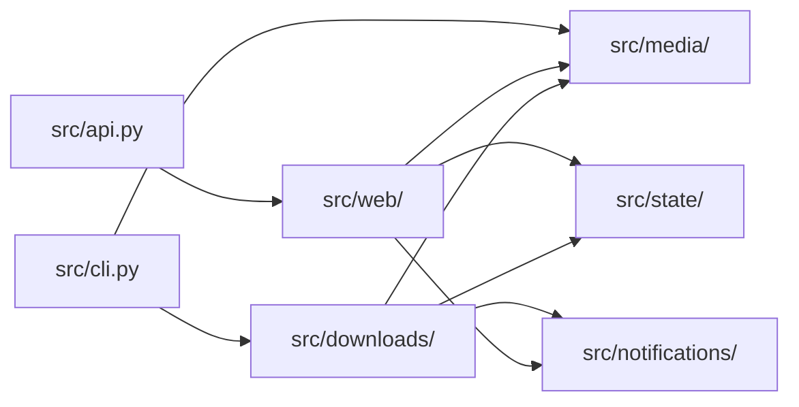

# Architecture

## Component boundaries



Each area has one job. `src/media/` interprets URLs without changing saved state. `src/state/` owns file formats and locks. `src/downloads/` turns URLs into published MP3 files and uses `YtDlpClient` to run external commands. `src/notifications/` posts failures to Apprise and only receives a title and body. `src/web/` builds the app and owns request security, routes, and HTML. `src/api.py` exports the production app created by `create_app()`.

## End-to-end flow

1. The downloader reads `urls.txt` and treats each non-comment line as an `http` or `https` URL for `yt-dlp`.
2. Direct YouTube video URLs are normalized into canonical watch URLs.
3. YouTube channel and playlist URLs are expanded with `yt-dlp --flat-playlist`. For channels, `/videos` checks normal uploads, `/streams` checks livestreams, and a bare channel URL becomes `/videos`. Playlists are limited to `channel_count` entries.
4. Direct YouTube videos wait when `min_channel_video_age_hours > 0`, unless the user skips the wait from the CLI or web UI.
5. Channel results are filtered. YouTube Shorts are skipped, as are videos newer than `min_channel_video_age_hours` when upload age is known. This includes results where `yt-dlp` reports a timestamp placeholder but still provides an upload date.
6. Each selected video is downloaded as audio. SponsorBlock removal is enabled only for YouTube URLs.
7. Exact Rumble hosts use Chrome request impersonation through `curl-cffi` so Cloudflare accepts the page and metadata requests.
8. YouTube cookie use follows `always_use_cookies`: the app tries with cookies first or without them first, then makes one attempt using the other choice after a failure, timeout, empty result, or placeholder-only metadata.
9. MP3 files go under the configured download directory. Channel and playlist sources get their own folders; direct individual videos go into `singles/`. Filenames contain the channel or uploader, title, and extractor media ID.
10. A download succeeds only when an MP3 is created or changed inside the active source work folder.
11. Successful MP3 files receive an embedded date tag with the local completion time and a comment tag containing the source URL.
12. Before a scheduled full-queue cycle checks archived channel candidates, channel MP3 files older than `retention_days` are deleted when their metadata proves both the download date and source video URL. Playlist and single-video MP3 files are not deleted by retention cleanup.
13. Detailed diagnostics go to `download.log`; short browser messages go to `activity.log`. Failures appear in both: the full command and output in `download.log`, and a one-line cause in `activity.log`.
14. Successful direct-video URLs are removed from `urls.txt`. Successful expanded URLs are written to `downloaded_urls.txt`, so future channel scans do not download them again.

## Why the downloader checks file changes

A command’s exit code is not enough. `yt-dlp` can return `0` without creating or updating an MP3 in the target folder, so the project compares the MP3 files before and after each run.

Let:

- $B$ = the set of MP3 files before the download attempt
- $A$ = the set of MP3 files after the download attempt
- $s(p)$ = the state of file $p$, represented by its modification time and file size

A file changed when either:

$$
p \notin B
$$

or

$$
s_A(p) \ne s_B(p)
$$

The download succeeds only if at least one MP3 in the active source work folder satisfies that condition. Restricting both snapshots to that folder prevents a file created by another source or process from falsely proving that this URL worked.

The downloader passes `--no-mtime` to `yt-dlp`, so source timestamps are not preserved on output files. Audiobookshelf’s visible episode date comes from embedded audio metadata. After a successful download, an `ffmpeg` copy pass preserves the streams and metadata, then writes the Toronto/Eastern completion time to the `date` tag and the source URL to the `comment` tag.

YouTube URLs are normalized to canonical watch URLs before the comment is written, so `https://www.youtube.com/live/VIDEO_ID` and `https://www.youtube.com/watch?v=VIDEO_ID` have the same metadata identity. The rewrite uses a non-`.mp3` temporary filename and copies the result back to the original path without replacing its inode. This helps Audiobookshelf’s scanner and watcher keep the existing library file.

The embedded date also determines when a file is old enough to delete. Cleanup uses the local download completion date, not the YouTube release date or filesystem modification time. It applies only to current YouTube channel folders; playlist and single-video files are kept. Files with missing or unreadable dates, or without a source URL in the comment tag, remain in place because the downloader cannot safely prove that they should be deleted or identify the archive entry to remove.

When a channel MP3 is deleted, the downloader removes the same concrete video URL from `downloaded_urls.txt`. The file on disk and the expanded-item archive then stay in sync.

## YouTube cookie strategy

Browser cookies are authentication state. When a cookie file is configured, `always_use_cookies` in `config.ini` chooses the order of YouTube attempts:

- `true` (default): pass cookies on the first YouTube `yt-dlp` call for downloads, channel/playlist expansion, and metadata lookups; retry once without cookies when the attempt fails or returns no usable result.
- `false`: try without cookies first; retry once with `--cookies <file>` when the plain attempt fails or returns no usable result.

Non-YouTube downloads never use cookies.

The cookie file is in Netscape/Mozilla text format, usually `cookies.txt` in the active data directory. Its first line must be `# HTTP Cookie File` or `# Netscape HTTP Cookie File`; on Linux, line endings should be LF. In Docker, the default active data directory is the mounted `/data` volume. The authenticated web UI can replace the configured cookie file, validate its header, normalize line endings to LF, and set permission mode `600`.

## Download folder layout

`output_dir` contains finished MP3 files. `intermediate_dir` holds scratch downloads until they are published. Neither path contains or mirrors `urls.txt`.

```text
downloads/
├── channel-one/channel-one - episode-title [video-id].mp3
├── channel-two/channel-two - episode-title [video-id].mp3
├── playlist-name/creator - episode-title [video-id].mp3
└── singles/creator - episode-title [media-id].mp3
```

YouTube channel folder names come from the source URL after filesystem-safe cleanup. Playlist folder names prefer the title reported by `yt-dlp`; if it is unavailable, the downloader uses the `list=` identifier. Direct individual videos, including non-YouTube videos, go into `singles/`. The media ID distinguishes episodes with the same title and gives each filename a stable source component.

## Queue-file changes

The CLI and web UI both change `urls.txt`. In Docker, the downloader may remove completed URLs while the web UI appends new ones. Reads and writes therefore use an interprocess file lock: a lock shared by processes so one cannot overwrite another process’s newer changes.

YouTube URL normalization treats `/live/VIDEO_ID` and `/watch?v=VIDEO_ID` as the same video. The queue and bypass stores convert both to the watch URL before comparing entries.

The same lock protects `downloaded_urls.txt`, which the downloader writes and the web UI reads to check for duplicates. The UI cannot read a half-written archive.

The `src/state/` stores own these rules:

- `QueueStore` reads, appends, and removes entries in `urls.txt`.
- `ArchiveStore` reads and writes `downloaded_urls.txt` and owns the separate download-claim lock.
- `BypassStore` owns one-shot age-bypass entries.
- `ActivityLogStore` appends to and reads the tail of `activity.log`.
- `NotificationStore` reads and replaces `notifications.json`, the Apprise settings the web UI writes and the downloader reads.

Callers use these stores directly. The former `src/url_utils.py` and `src/activity_log.py` adapters were removed so URL rules cannot become a second place that writes state.

Both logs use `America/Toronto` through the shared `LOG_TIME_ZONE` setting and omit seconds for easier browser scanning. Docker Compose also sets `TZ=America/Toronto` so other process timestamps stay aligned.

Channel and playlist downloads hold a separate claim lock during the duplicate check, download, and success append. The archive file is locked only for short reads and writes, so a second downloader waits without blocking web archive checks for up to an hour. Failed attempts are not archived, so they can run again. Direct downloads use a separate process lock because all one-off items share the `singles` scratch folder.

## Deployment modes

### Local CLI mode

- Run `uv run python main.py`.
- Read `config.ini` from the project root.
- Write downloads to `downloads/` by default.
- Group MP3 files under direct child folders of `downloads/`.

### Docker scheduled mode

- `start.py` keeps the FastAPI app in the main process.
- A background thread runs the scheduler.
- The scheduler launches `python -m src.cli` from the project root at a fixed interval for the full queue.
- Direct video URLs added through the web UI use an immediate single-URL run and do not inspect the rest of `urls.txt`.
- Channel and playlist URLs added through the web UI wait for the scheduled full-queue run.
- Runtime state lives in `PODCAST_DATA_DIR`.

## Safety boundaries

- `yt-dlp` and SponsorBlock are external dependencies.
- SponsorBlock is used only for YouTube. Non-YouTube URLs go through `yt-dlp` without SponsorBlock flags and with `--no-playlist`.
- Rumble URLs additionally use Chrome request impersonation. Exact hostname matching prevents a lookalike host from receiving provider-specific command policy.
- Queue URLs are user input and are passed to `yt-dlp` after `--`, so they cannot be interpreted as command-line flags.
- Proxy headers are trusted only when `trust_x_forwarded_for = true`.
- Browser sessions are saved in `.ui_sessions.json` and are not tied to the login IP. The client IP is used only for temporary login bans. Public entry pages send a browser with a valid session to `/ui`.
