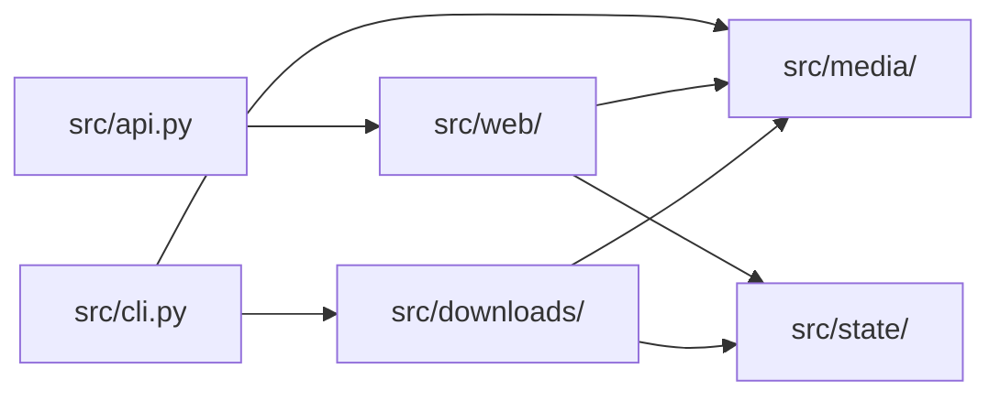

# Architecture

## Component boundaries



`src/media/` interprets URLs without changing saved state. `src/state/` owns
the file formats and locks. `src/downloads/` turns individual URLs into
published MP3 files, using `YtDlpClient` to run external commands. `src/web/`
builds the app and owns request security, routes, and HTML. `src/api.py` only
exports the production app created by `create_app()`.

## End-to-end flow

1. The downloader reads `urls.txt`.
2. It checks each non-comment line as an `http` or `https` media URL that `yt-dlp` can try.
3. YouTube direct video URLs are normalized into canonical watch URLs.
4. YouTube channel and playlist URLs are turned into individual videos with `yt-dlp --flat-playlist`. For channels, `/videos` checks normal uploads, `/streams` checks livestreams, and a bare channel URL becomes `/videos`. Playlists are limited to `channel_count` entries instead of reading the whole playlist.
5. Direct YouTube videos also wait when `min_channel_video_age_hours > 0`, unless the user skips that wait from the CLI or web UI.
6. Channel results are filtered:
   - YouTube Shorts are skipped.
   - Videos newer than `min_channel_video_age_hours` are skipped when upload age is known, including when `yt-dlp` reports a timestamp placeholder but still provides an upload date.
7. Each selected video is downloaded as audio. SponsorBlock removal is enabled only for YouTube URLs.
8. YouTube cookie usage follows `always_use_cookies`: the app either uses cookies first or tries without them first, then makes one attempt with the other choice after a failure, timeout, empty result, or placeholder-only metadata.
9. MP3 output goes under the configured download directory: channel and playlist sources each get their own folder, while direct individual videos go into `singles/`. Each filename contains the channel or uploader, title, and extractor media ID.
10. A download counts as successful only when an MP3 file was created or changed inside the active source work folder.
11. Successful MP3 files get an embedded MP3 date tag set to the local download completion time and a comment tag containing the source URL.
12. Before a scheduled full-queue cycle checks archive-backed channel candidates, YouTube channel MP3 files older than `retention_days` are deleted when embedded metadata proves both the download date and source video URL. Playlist and single-video MP3 files are not retention-deleted.
13. The downloader writes detailed diagnostics to `download.log` and short browser-facing messages to `activity.log`. Failures appear in both: the full yt-dlp command and output in `download.log`, and a one-line cause in `activity.log`.
14. Successful direct-video URLs are removed from `urls.txt`.
15. Successful expanded URLs are written to `downloaded_urls.txt` so future channel scans stay idempotent.

## Why the downloader checks file changes

A command's exit code is not enough. `yt-dlp` can return `0` even when it did not create or update an MP3 in the target folder. The project therefore records the MP3 files before and after each run.

Let:

- $B$ = the set of MP3 files before the download attempt
- $A$ = the set of MP3 files after the download attempt
- $s(p)$ = the file state of file $p$, represented by its modification time and file size

Then a file is treated as changed if either:

$$
p \notin B
$$

or

$$
s_A(p) \ne s_B(p)
$$

The download is successful only if at least one MP3 in the active source work folder satisfies that condition. Limiting both snapshots to that folder is important: a file created by another source or process cannot prove that this URL worked.

The downloader also passes `--no-mtime` to `yt-dlp`. That flag is useful hygiene because it prevents source timestamps from being preserved on the output file, but Audiobookshelf's visible podcast episode date comes from embedded audio metadata. After a successful download, the downloader runs a small `ffmpeg` copy pass over each changed MP3, preserves existing streams and metadata, and overwrites the embedded `date` metadata with the Toronto/Eastern completion timestamp. The same pass writes the source URL to the embedded `comment` metadata. YouTube URLs are normalized to canonical watch URLs before writing that comment, so `https://www.youtube.com/live/VIDEO_ID` and `https://www.youtube.com/watch?v=VIDEO_ID` do not create separate metadata identities. The rewrite uses a non-`.mp3` temporary filename, then copies the rewritten bytes back into the original MP3 path without replacing that path's inode. That matters because Audiobookshelf's scanner and watcher use file paths and inode values when matching library files. Audiobookshelf maps the embedded audio date into `podcastEpisode.pubDate` / `podcastEpisode.publishedAt`.

The same embedded date decides when a file is old enough to delete. The project uses the local download completion date, not the YouTube release date or the file's modification time. Cleanup applies only to current YouTube channel folders. Playlist and single-video files are kept. Files with missing or unreadable dates, or without a source URL in the comment tag, stay in place because cleanup cannot safely prove that they should be deleted or which archive entry to remove.

When a channel MP3 is deleted, the downloader removes the same concrete video URL from `downloaded_urls.txt`. That keeps the audio file and expanded-item archive consistent: an old file removed from disk is no longer treated as already downloaded forever.

## YouTube cookie strategy

Browser cookies are authentication state. When a cookie file is configured, `always_use_cookies` in `config.ini` chooses the YouTube strategy:

- `true` (default): pass cookies on the first YouTube `yt-dlp` call for downloads, channel/playlist expansion, and metadata lookups; retry once without cookies when that attempt fails or returns no usable result.
- `false`: try without cookies first; retry once with `--cookies <file>` when the plain attempt fails or returns no usable result.

Non-YouTube downloads never use cookies.

The configured cookie file is a Netscape/Mozilla-format text file, usually `cookies.txt` in the active data directory. The first line must be `# HTTP Cookie File` or `# Netscape HTTP Cookie File`, and line endings should be LF on Linux. In Docker, the default active data directory is the mounted `/data` volume. The web UI exposes an authenticated cookie upload that overwrites the configured cookie file, requires the same session and CSRF controls as queue edits, validates the Netscape header, normalizes uploaded line endings to LF, and sets permission mode `600`.

## Download folder layout

The configured `output_dir` is the root for finished MP3 files only. `intermediate_dir` holds scratch downloads until they are published. Neither path contains or mirrors `urls.txt`.

```text
downloads/
├── channel-one/channel-one - episode-title [video-id].mp3
├── channel-two/channel-two - episode-title [video-id].mp3
├── playlist-name/creator - episode-title [video-id].mp3
└── singles/creator - episode-title [media-id].mp3
```

YouTube channel folder names are derived from the source URL and sanitized for the filesystem. YouTube playlist folder names prefer the playlist title reported by `yt-dlp`; if that metadata is unavailable, the downloader falls back to the `list=` identifier. Direct individual videos, including direct YouTube videos and non-YouTube videos, are written to `singles/`. The media ID in every filename distinguishes episodes that share a title and gives the filesystem identity a stable source component.

## Queue-file mutation model

Both the CLI and the web UI mutate `urls.txt`. In Docker deployments, the downloader may be removing completed video URLs at the same time the web UI is appending new URLs. To avoid lost updates, queue-file reads and writes now use an interprocess file lock.

Without the lock, this could happen:

1. Downloader reads `urls.txt`.
2. Web UI appends a new URL.
3. Downloader writes an older in-memory copy of the file back to disk.
4. The newly appended URL disappears.

The lock forces those operations to run one at a time.

YouTube URL normalization also treats the `/live/VIDEO_ID` route as the same concrete video as `/watch?v=VIDEO_ID`. Completed livestreams can move between those shapes in user-submitted links and YouTube surfaces, so the queue and bypass stores collapse them to the watch URL before comparing entries.

The same lock protects `downloaded_urls.txt`, which the downloader writes and the web UI reads when checking for duplicates. The UI therefore cannot read a half-written archive.

The lock and file-mutation rules are owned by `src/state/` stores:

- `QueueStore` owns `urls.txt` reads, appends, and removals.
- `ArchiveStore` owns `downloaded_urls.txt` reads and writes plus the separate download-claim lock.
- `BypassStore` owns one-shot age-bypass entries.
- `ActivityLogStore` owns `activity.log` appends and tail reads.

Callers use these stores directly. The former `src/url_utils.py` and `src/activity_log.py` adapters were removed so media policy cannot accidentally become another persistence boundary.

`activity.log` and `download.log` timestamps both use `America/Toronto` through a shared `LOG_TIME_ZONE` setting and omit seconds for easier browser scanning. Docker Compose also sets `TZ=America/Toronto` so other process timestamps stay aligned.

Channel and playlist downloads hold a separate download-claim lock during the duplicate check, download, and success append. The archive file itself is locked only for each short read or write, so a second downloader still waits without blocking the web UI from checking archive entries for up to an hour. The URL is added only after success, so failed attempts can run again. Direct downloads use a separate process lock because all one-off items share the `singles` scratch folder.

## Deployment modes

### Local CLI mode

- Run `uv run python main.py`
- Reads `config.ini` from the project root.
- Writes downloads to `downloads/` by default.
- Groups MP3 files under direct child folders of `downloads/`.

### Docker scheduled mode

- `start.py` keeps the FastAPI app in the main process.
- A background thread runs the scheduler.
- The scheduler launches `python -m src.cli` from the project root at a fixed interval for the full queue.
- Direct video URLs added through the web UI use an immediate single-URL run, which does not inspect the rest of `urls.txt`.
- Channel and playlist URLs added through the web UI wait for the scheduled full-queue run.
- Runtime state lives in `PODCAST_DATA_DIR`.

## Trust boundaries

- `yt-dlp` and SponsorBlock are external dependencies.
- SponsorBlock is a YouTube-only cleanup step in this project; non-YouTube URLs are passed through `yt-dlp` without SponsorBlock flags and with `--no-playlist`.
- Queue URLs are user input and are always passed to `yt-dlp` after `--` so they cannot be interpreted as command-line flags.
- Proxy headers are only trusted when `trust_x_forwarded_for = true`.
- Browser sessions are saved in `.ui_sessions.json` and are not tied to the login IP. The client IP is used only for temporary login bans. Public entry pages send a browser with a valid session to `/ui`.
