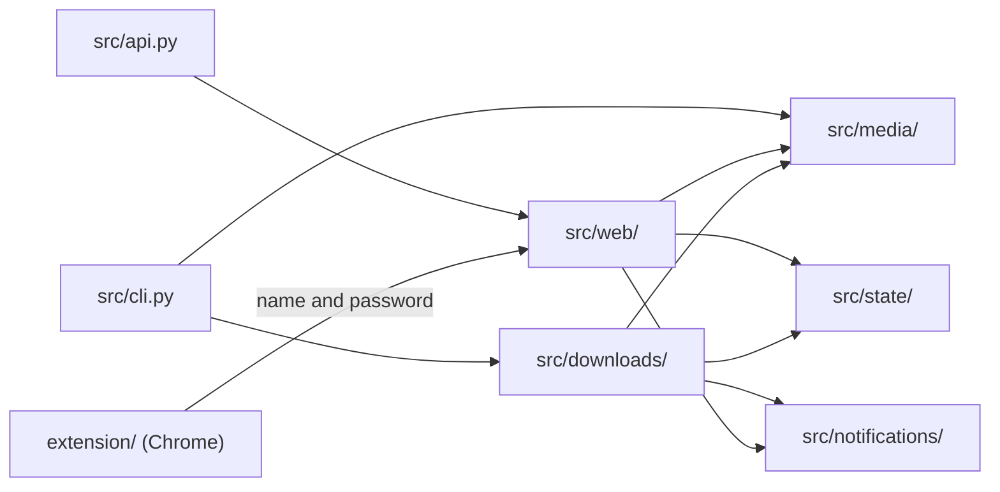

# Architecture

## Component boundaries



Each area has one job:

- `src/media/` interprets URLs without changing saved state.
- `src/state/` owns file formats and locks.
- `src/downloads/` turns URLs into MP3 files and runs `yt-dlp`.
- `src/notifications/` sends failures to Apprise.
- `src/web/` builds the app and owns security, routes, and HTML.
- `src/api.py` exports the production app created by `create_app()`.

The web app has two clients, both using the same `.env` accounts. A browser
submits a form with a session cookie and form token. The Chrome extension and
other programs call `/api` with the username and password in an
`Authorization` header. They cannot use the browser cookie: it is `HttpOnly`
and `SameSite=lax`, so scripts cannot read it and the browser does not send it
with a cross-site `POST`. `src/web/account_auth.py` owns the account check and
failed-login ban, so both clients follow the same rules.

Both clients add URLs through `src/web/queue_actions.py`. Validation,
normalization, duplicate handling, and immediate downloads therefore behave the
same way from the form and the API.

## End-to-end flow

1. Read each non-comment URL from `urls.txt`.
2. Normalize direct YouTube video URLs to canonical watch URLs.
3. Expand YouTube channels and playlists with `yt-dlp --flat-playlist`.
   Channels use `/videos` for normal uploads, `/streams` for livestreams,
   and `/videos` for a bare channel URL. Scheduled playlist checks consider
   only the newest `channel_count` entries.
4. Wait for direct YouTube videos when
   `min_channel_video_age_hours > 0`, unless the user skips the wait.
5. For channel results, skip Shorts and videos that are too new when the upload
   age is known.
6. Download the selected items as audio. Use SponsorBlock only for YouTube.
7. For exact Rumble hosts, use Chrome request impersonation through
   `curl-cffi` so Cloudflare accepts the requests.
8. Follow `always_use_cookies` for YouTube: try with cookies first or without
   them first, then try the other option after a failure, timeout, empty result,
   or placeholder-only metadata.
9. Write MP3 files under the configured output directory. Channels and playlists
   get their own folders; direct videos go into `singles/`.
10. Count a download as successful only when an MP3 is created or changed in the
    active source folder.
11. Add the local completion time and source URL to the MP3 metadata.
12. During a scheduled full-queue pass, delete old channel MP3 files when their
    metadata proves both the download date and source video URL. Playlist and
    single-video files are not removed by retention cleanup.
13. Write detailed diagnostics to `download.log` and short browser messages to
    `activity.log`.
14. Remove successful direct URLs from `urls.txt`. Add successful expanded
    URLs to `downloaded_urls.txt` so later channel scans skip them.

## Why success depends on file changes

A successful process exit is not enough: `yt-dlp` can return `0` without
creating an MP3. The downloader therefore compares the MP3 files in the active
source folder before and after each attempt.

Let:

- $B$ be the set of MP3 files before the attempt.
- $A$ be the set after the attempt.
- $s(p)$ is the state of file $p$, represented by its modification time and size.

A file changed when:

$$
p \notin B
$$

or:

$$
s_A(p) \ne s_B(p)
$$

The attempt succeeds only if at least one file changed. Looking only in the
active folder prevents another process's file from creating a false success.

The downloader passes `--no-mtime`, so source timestamps do not become file
timestamps. After a successful download, an `ffmpeg` copy pass preserves the
audio and writes the local completion time to the `date` tag and source URL to
the `comment` tag. YouTube URLs are normalized first. The result is copied back
without replacing the original inode, which helps Audiobookshelf keep tracking
the file.

Retention uses the embedded local completion date, not the release date or file
modification time. It applies only to current YouTube channel folders. Files
without a readable date or source URL stay in place because they cannot be
identified safely.

When a channel MP3 is deleted, its concrete video URL is also removed from
`downloaded_urls.txt`, keeping the file and archive in sync.

## YouTube cookies

A cookie file carries authentication state. When one exists,
`always_use_cookies` chooses the attempt order:

- `true` (default): use cookies first for downloads, channel/playlist
  expansion, and metadata; retry without them when needed.
- `false`: try without cookies first; retry with cookies when needed.

Non-YouTube downloads never use cookies.

The file uses Netscape/Mozilla text format. Its first line must be
`# HTTP Cookie File` or `# Netscape HTTP Cookie File`; Linux and macOS files
should use LF line endings. The web UI validates the header, converts line
endings to LF, and replaces the file with owner-only permissions.

## Download layout

`output_dir` contains finished MP3s. `intermediate_dir` holds temporary work.
Neither path contains or mirrors the queue files.

```text
downloads/
├── channel-one/channel-one - episode-title [video-id].mp3
├── channel-two/channel-two - episode-title [video-id].mp3
├── playlist-name/creator - episode-title [video-id].mp3
└── singles/creator - episode-title [media-id].mp3
```

Channel folder names come from the source URL after filesystem-safe cleanup.
Playlist names prefer the title from `yt-dlp`; otherwise they use the
`list=` identifier. The media ID keeps episodes with the same title distinct.

## Queue and saved state

The command line and web UI can both change `urls.txt`. The downloader may
remove completed URLs while the web UI appends new ones, so the stores use
interprocess locks to stop one process from overwriting another process's newer
changes.

YouTube `/live/VIDEO_ID` and `/watch?v=VIDEO_ID` URLs become the same watch
URL before queue and bypass comparisons. `downloaded_urls.txt` uses the same
locking so the web UI never reads a partial archive.

The state stores own these rules:

- `QueueStore`: reads, appends, and removes `urls.txt`.
- `ArchiveStore`: reads and writes `downloaded_urls.txt` and owns the download claim lock.
- `BypassStore`: owns one-use age-check exceptions.
- `ActivityLogStore`: appends to and reads the tail of `activity.log`.
- `NotificationStore`: reads and replaces `notifications.json`.

Both logs use the `America/Toronto` timezone and omit seconds for easier
scanning in the browser. Channel and playlist downloads hold a separate claim
lock through duplicate checking, downloading, and success recording. Failed
attempts are not archived. Direct downloads use another process lock because
they share the `singles` scratch folder.

## Deployment modes

### Local command line

- Run `uv run python main.py`.
- Read `config.ini` from the project root.
- Write to `downloads/` by default.
- Group files under direct child folders of the output directory.

### Docker scheduled mode

- `start.py` keeps FastAPI in the main process.
- A background thread runs the scheduler.
- The scheduler launches `python -m src.cli` for the full queue at a fixed interval.
- Direct videos added through the web UI start an immediate single-URL run.
- Channels and playlists wait for the scheduled full-queue run.
- Runtime state lives in `PODCAST_DATA_DIR`.

## Safety boundaries

- `yt-dlp` and SponsorBlock are external dependencies.
- SponsorBlock is used only for YouTube. Other sites use `--no-playlist`.
- Exact Rumble host matching prevents a lookalike host from receiving Rumble settings.
- Queue URLs are passed to `yt-dlp` after `--`, so they cannot become command-line flags.
- Proxy headers are trusted only when `trust_x_forwarded_for = true`.
- Browser sessions are stored in `.ui_sessions.json` and are not tied to the login IP. The IP is used only for temporary login bans.
