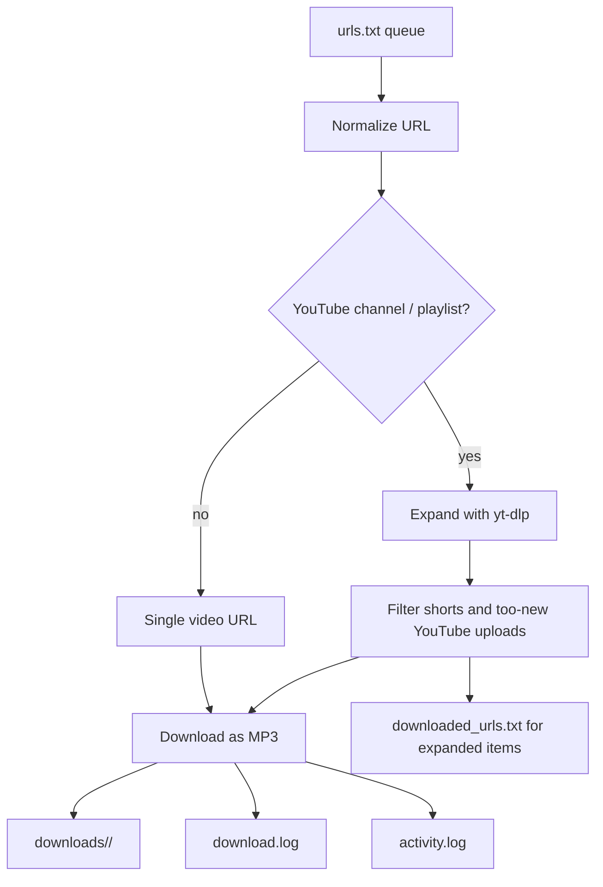

# Podcast Downloader

Podcast Downloader is a small personal tool for turning online videos into MP3 files, removing SponsorBlock segments from YouTube downloads, and managing a queue from the command line or a browser UI.

## What it does

- Accepts direct video URLs from `http` and `https` sites.
- Accepts YouTube `youtu.be` short links, channel URLs, channel livestream tabs, and playlist URLs.
- Finds the configured number of recent videos in each YouTube channel or playlist with `yt-dlp`.
- Uses the channel tab as the source mode: `/videos` means normal uploads, `/streams` means livestream entries, and a bare channel URL defaults to `/videos`.
- Filters out YouTube Shorts.
- Can wait before downloading new YouTube videos, giving SponsorBlock time to add segment data.
- Downloads audio as MP3 and stores it locally. The files also carry metadata,
  small descriptive tags such as the source URL and download date.
- Groups MP3 files by source under `downloads/`; direct videos go in `singles/`.
- Deletes old channel MP3 files according to the embedded download date, while leaving playlist and one-off files alone.
- Lets you add new URLs through a password-protected web form.

## Main parts

- `src/cli.py`: command-line entrypoint.
- `src/downloads/`: download orchestration, `yt-dlp`, and audio metadata.
- `src/media/`: generic URL validation and YouTube-specific policy.
- `src/state/`: locked queue, archive, bypass, activity, and authentication state.
- `src/web/`: FastAPI construction, routes, authentication policy, and rendering.
- `src/api.py`: small Uvicorn deployment entrypoint.
- `start.py`: Docker-oriented process supervisor for the API plus scheduler.

## Project shape

## Recommended reading order

1. [Architecture](./architecture.md)
2. [CLI and Config](./cli-and-config.md)
3. [Web UI and Security](./web-ui-security.md)
4. [Operations](./operations.md)
