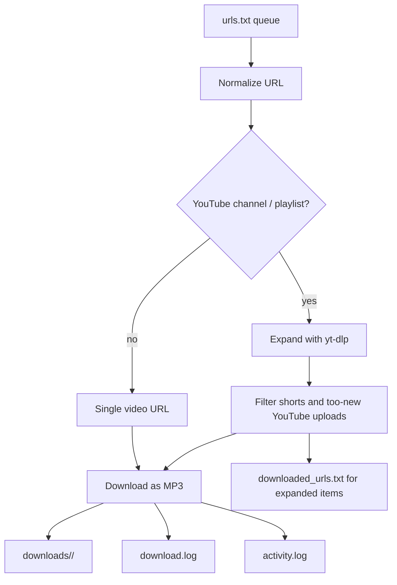

# Podcast Downloader

Podcast Downloader is a small personal-use system for turning web videos into MP3 files, trimming SponsorBlock segments for YouTube, and managing a queue through either the command line or a lightweight browser UI.

## What it does

- Accepts direct video URLs from `http` and `https` websites.
- Accepts YouTube `youtu.be` short links, channel URLs, channel livestream tabs, and playlist URLs.
- Expands YouTube channel and playlist URLs into the latest configured number of individual videos with `yt-dlp`.
- Uses the channel tab as the source mode: `/videos` means normal uploads, `/streams` means livestream entries, and a bare channel URL defaults to `/videos`.
- Filters out YouTube Shorts.
- Optionally skips YouTube channel uploads and direct YouTube videos that are too new for reliable SponsorBlock coverage.
- Downloads audio as MP3 and stores it locally.
- Groups MP3 files by source folder under `downloads/`, with direct individual videos in `singles/`.
- Deletes YouTube channel MP3 files older than the configured retention window based on embedded download-date metadata, while leaving playlist and single-video files alone.
- Lets you append new URLs from a password-protected web form.

## Main components

- `src/cli.py`: command-line entrypoint.
- `src/downloader.py`: download orchestration and success detection.
- `src/url_utils.py`: URL normalization, queue-file mutation, and channel expansion.
- `src/api.py`: web login flow, queue UI, and concise activity viewer.
- `start.py`: Docker-oriented process supervisor for the API plus scheduler.

## Project shape

## Recommended reading order

1. [Architecture](./architecture.md)
2. [CLI and Config](./cli-and-config.md)
3. [Web UI and Security](./web-ui-security.md)
4. [Operations](./operations.md)
5. [Review and Safety Notes](./review-and-safety.md)
