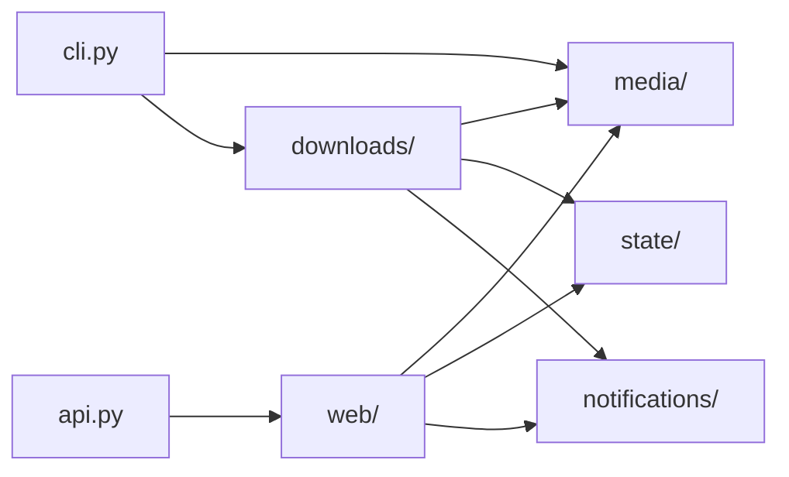

# Source Guide

## Part 1: Architecture

`src/` is the importable application package. Each decision belongs to one area:

- `media/` decides whether a URL is supported and how to interpret YouTube URLs.
- `state/` owns saved file formats and locking.
- `downloads/` turns individual media URLs into published MP3 files.
- `notifications/` posts failures to Apprise.
- `web/` builds the FastAPI app and owns request security, routes, and HTML.
- `cli.py` parses commands and sends work to the stores or download service.

Notifications must not fail a download: delivery problems return as a result, never an exception. URL rules must not edit queue or history files. State stores must not run `yt-dlp`. The download service coordinates these areas without taking over their responsibilities.

## Part 2: Code Reference

- `api.py`: small Uvicorn entrypoint exporting `app = create_app()`.
- `cli.py`: command-line parser and dispatch.
- `config.py`: validated `PodcastConfig` loading.
- `passwords.py`: Password-Based Key Derivation Function 2 (PBKDF2) hashing and verification.
- `credentials.py`: startup sync that reads up to three account slots from `.env` (`UI_USERNAME`/`UI_PASSWORD` plus the numbered `_2` and `_3` pairs), hashes each password, checks the hashes, and writes the account list to `.ui_credentials.json` for the login route.
- `trigger.py`: in-process requests that wake the Docker scheduler.
- `log_timezone.py`: shared Toronto/Eastern logging timezone.
- `media/GUIDE_media.md`: generic URL validation and YouTube policy.
- `state/GUIDE_state.md`: locked plain-file state.
- `downloads/GUIDE_downloads.md`: download workflow and external clients.
- `web/GUIDE_web.md`: application construction, authentication, routes, pages.

Start with the smallest owner that matches the change. YouTube URL classification belongs in `media/youtube.py`; an MP3 publication rule belongs in `downloads/service.py`; a queue edit belongs in `state/queue_store.py`.

## Part 3: Journal

- 2026-07-26: Removed catch-all compatibility modules and established explicit
  `web`, `media`, `downloads`, and `state` boundaries.
