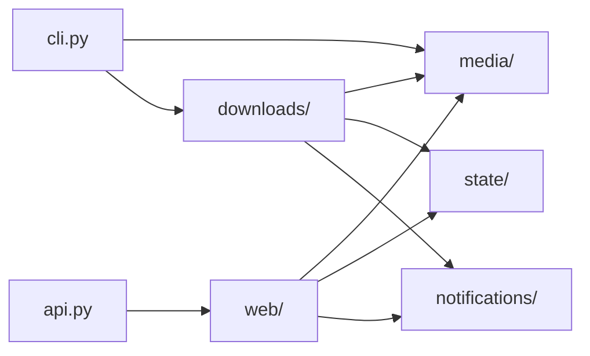

# Source guide

## Architecture

`src/` is the importable application package. Each area has one focused job:

- `media/` validates URLs and interprets YouTube URLs.
- `state/` owns saved-file formats and locks.
- `downloads/` turns media URLs into published MP3 files.
- `notifications/` sends failures to Apprise.
- `web/` builds the FastAPI app and owns security, routes, HTML, and the JSON API the Chrome extension calls.
- `cli.py` parses commands and sends work to the right store or service.

Notifications report delivery failures as results instead of breaking a
download. URL rules do not write queue or history files, and state stores do
not run `yt-dlp`. The download service coordinates these areas without taking
over their jobs.

## Code reference

- `api.py`: Uvicorn entrypoint exporting `app = create_app()`.
- `cli.py`: command-line parser and dispatcher.
- `config.py`: validated `PodcastConfig` loading.
- `passwords.py`: Password-Based Key Derivation Function 2 (PBKDF2) hashing and verification.
- `credentials.py`: syncs up to three `.env` account pairs into `.ui_credentials.json`.
- `trigger.py`: in-process requests that wake the Docker scheduler, including whole-queue, newly added URL, full-playlist, and targeted saved-source requests.
- `schedule.py`: turns `scheduled_run_hour` and `scheduled_run_interval_days` into run times, and writes the "7 hours ago" wording the queue page shows.
- `log_timezone.py`: the project's clock. Owns the timezone, the timestamp format, and `local_now()`, so nothing else reads the system clock directly.
- `human_time.py`: writes times and durations the way a person reads them, such as "7 hours ago" and "in 4 days".
- `schedule.py`: when automatic runs happen, in calendar terms only. No wording, no state.
- `run_report.py`: decides whether a finished run is worth a notification, and writes the words. Pure; it reads no files and sends nothing.
- `cookie_file.py`: reads a Netscape `cookies.txt` to report how many cookies it holds and when its YouTube sign-in expires. Read-only; it never rewrites the file.
- `media/GUIDE_media.md`: URL validation and YouTube policy.
- `state/GUIDE_state.md`: locked plain-file state.
- `downloads/GUIDE_downloads.md`: download workflow and external clients.
- `web/GUIDE_web.md`: application construction, authentication, routes, and pages.

Start with the smallest owner that matches the change: YouTube classification
belongs in `media/youtube.py`, MP3 publication in `downloads/service.py`, and a
queue edit in `state/queue_store.py`.

## Journal

- 2026-09-01: Split time handling three ways after a review: `log_timezone.py` owns the clock, `human_time.py` owns the wording, `schedule.py` owns the calendar. The download pipeline had been importing the scheduler just to phrase a sentence.
- 2026-09-01: Added `run_report.py`. The downloader reported failed downloads but not the failure that produces none: a blocked listing attempts nothing, so nothing fails, so nothing was sent.
- 2026-09-01: Added `cookie_file.py`. Cookie expiry was invisible until downloads started failing, and the expiry date is already in the file's fifth field.
- 2026-09-01: Automatic runs moved from a countdown between runs to a fixed time of day. `schedule.py` decides when; `state/run_state_store.py` records what happened.
- 2026-07-26: Removed catch-all compatibility modules and established explicit `web`, `media`, `downloads`, and `state` boundaries.
