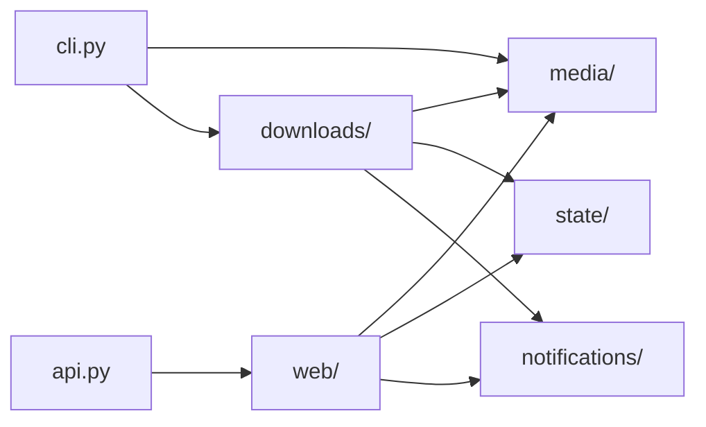

# Source guide

## Architecture

`src/` is the importable application package. Each area has a focused job:

- `media/` validates URLs and interprets YouTube URLs.
- `state/` owns saved-file formats and locks.
- `downloads/` turns media URLs into published MP3 files.
- `notifications/` sends failures to Apprise.
- `web/` builds the FastAPI app and owns security, routes, HTML, and the JSON API the Chrome extension calls.
- `cli.py` parses commands and sends work to the right store or service.

Notifications report delivery failures as results instead of breaking a
download. URL rules do not write queue or history files. State stores do not
run `yt-dlp`. The download service coordinates these areas without taking over
their jobs.

## Code reference

- `api.py`: Uvicorn entrypoint exporting `app = create_app()`.
- `cli.py`: command-line parser and dispatcher.
- `config.py`: validated `PodcastConfig` loading.
- `passwords.py`: Password-Based Key Derivation Function 2 (PBKDF2) hashing and verification.
- `credentials.py`: syncs up to three `.env` account pairs into `.ui_credentials.json`.
- `trigger.py`: in-process requests that wake the Docker scheduler.
- `log_timezone.py`: shared Toronto/Eastern logging timezone.
- `media/GUIDE_media.md`: URL validation and YouTube policy.
- `state/GUIDE_state.md`: locked plain-file state.
- `downloads/GUIDE_downloads.md`: download workflow and external clients.
- `web/GUIDE_web.md`: application construction, authentication, routes, and pages.

Start with the smallest owner that matches the change: YouTube classification
belongs in `media/youtube.py`, MP3 publication in `downloads/service.py`, and a
queue edit in `state/queue_store.py`.

## Journal

- 2026-07-26: Removed catch-all compatibility modules and established explicit `web`, `media`, `downloads`, and `state` boundaries.
