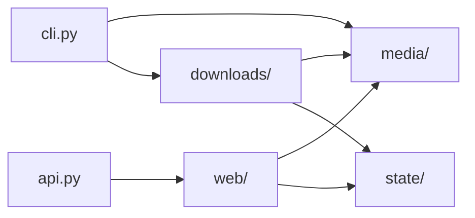

# Source Guide

## Part 1: Architecture

`src/` is the importable application package. Dependencies flow from entry
surfaces into domain owners:

- `media/` decides whether a URL is supported and what a YouTube URL means.
- `state/` owns durable file formats and locking.
- `downloads/` turns concrete media URLs into published MP3 files.
- `web/` constructs the FastAPI app and owns request security, routes, and HTML.
- `cli.py` parses commands and dispatches to stores or `PodcastDownloadService`.

Provider policy must not mutate queue or archive files. State stores must not
run `yt-dlp`. The download service coordinates both without reimplementing
their low-level rules.

## Part 2: Code Reference

- `api.py`: small Uvicorn entrypoint exporting `app = create_app()`.
- `cli.py`: command-line parser and dispatch.
- `config.py`: validated `PodcastConfig` loading.
- `passwords.py`: Password-Based Key Derivation Function 2 (PBKDF2) hashing and
  verification.
- `credentials.py`: startup sync that reads `UI_USERNAME` and `UI_PASSWORD`
  from `.env`, hashes the password, self-tests the hash, and writes
  `.ui_credentials.json` for the login route.
- `trigger.py`: in-process requests that wake the Docker scheduler.
- `log_timezone.py`: shared Toronto/Eastern logging timezone.
- `media/GUIDE_media.md`: generic URL validation and YouTube policy.
- `state/GUIDE_state.md`: locked plain-file state.
- `downloads/GUIDE_downloads.md`: download workflow and external clients.
- `web/GUIDE_web.md`: application construction, authentication, routes, pages.

Start in the smallest owner matching the change. For example, YouTube URL
classification belongs in `media/youtube.py`; an MP3 publication rule belongs
in `downloads/service.py`; a queue mutation belongs in `state/queue_store.py`.

## Part 3: Journal

- 2026-07-26: Removed catch-all compatibility modules and established explicit
  `web`, `media`, `downloads`, and `state` boundaries.
